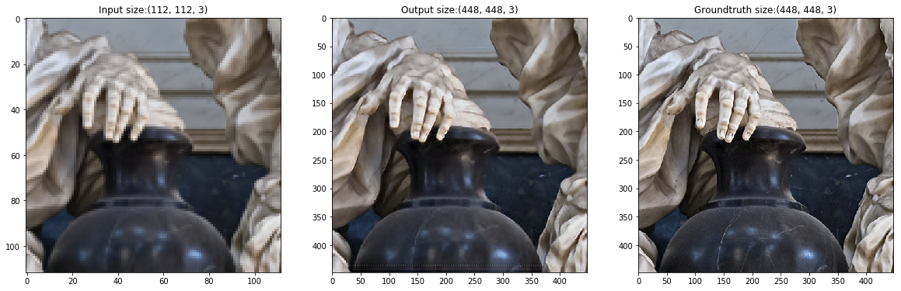
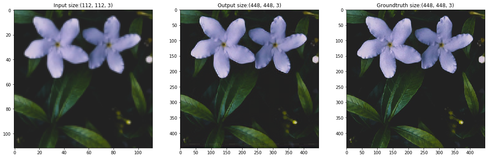
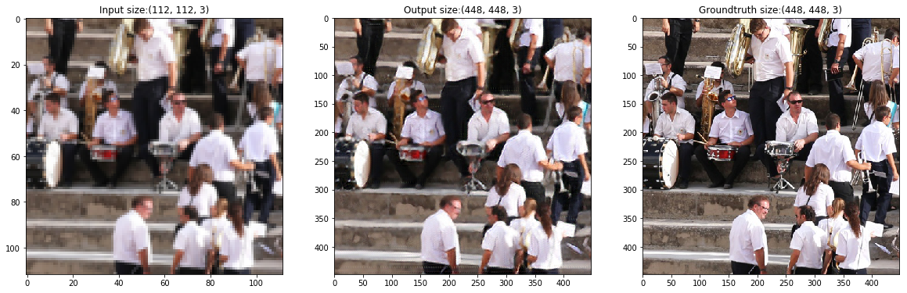

# PyTorch_NatSR
Unofficial PyTorch implementation of NatSR

### Results

### Reference
Natural and Realistic Single Image Super-Resolution with Explicit Natural Manifold Discrimination\
Jae Woong Soh, Gu Yong Park, Junho Jo, and Nam Ik Cho\
[[Paper]](http://openaccess.thecvf.com/content_CVPR_2019/papers/Soh_Natural_and_Realistic_Single_Image_Super-Resolution_With_Explicit_Natural_Manifold_CVPR_2019_paper.pdf)
[[Supplementary]](http://openaccess.thecvf.com/content_CVPR_2019/supplemental/Soh_Natural_and_Realistic_CVPR_2019_supplemental.pdf)
[[Official Implementation]](https://github.com/JWSoh/NatSR)
